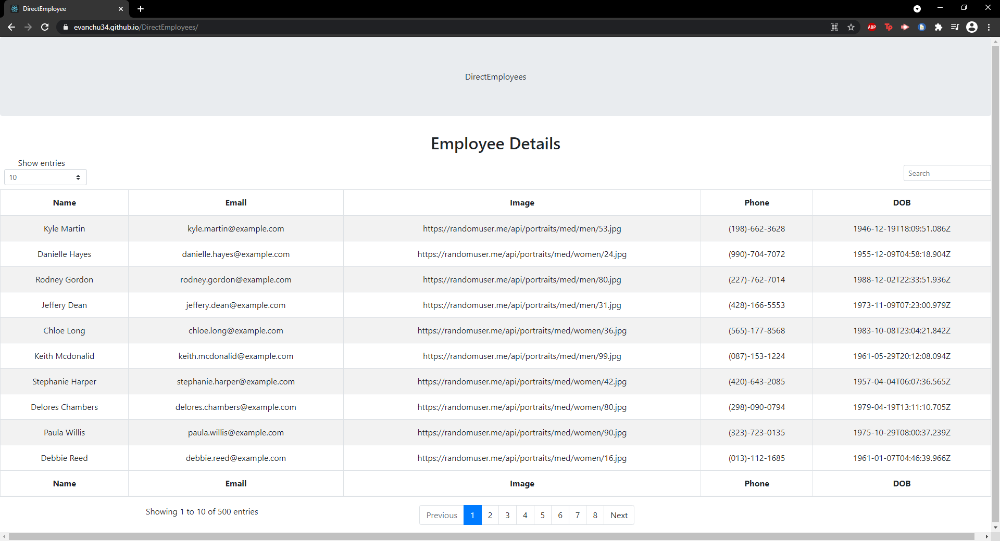

# DirectEmployees

## Table of Contents

1. [About](#about)
1. [Pictures/Gif of Application](#pictures/gif-of-application)
1. [Live Application](#live-application)
1. [Getting Started](#getting-started)

---------------------------	

## About
DirectEmployee is an application that helps in many ways. The application
is espcially useful for managers or new employees. DirectEmployee stores a company's
employees in one nice directory for them. The user is allowed to sort by name, phone, email,
and date of birth. You can do this by clicking on the title tabs. The categories can be sorted
from first to last. You can also navigate to more profiles by cycling through the pages.

---------------------------

## Live Application

You can find the live application here: 

https://evanchu34.github.io/DirectEmployees/

---------------------------

## Pictures/Gif of Application

---------------------------	

## Getting Started 
Before you start, you need a few things:
* Setup a React App 
* mdbreact
* Axios

---------------------------	
